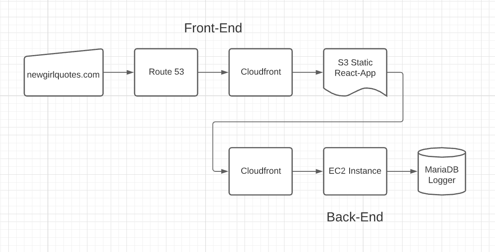

# New Girl Quote Searcher

## What is this?

This app is a Quote Searching Service for the show [New Girl](https://www.imdb.com/title/tt1826940/), live at [newgirlquotes.com](https://newgirlquotes.com).


## Installation

Install node packages using ```npm install```

This app will access an API that I have created that is running at a separate [URL](http://d1uwzs0p105509.cloudfront.net/?quote=example). This API's source code is accessible at a [seperate Github repository](https://github.com/patrickcopp/NewGirlQuotes).

If you would like to run this app through NodeJS, you can use the app.js file in the root directory (```node app.js```) after creating a production build of the react-app (```npm run build```). Alternatively, because this is a React app, if you want React to handle the server, you can simply run with ```npm run start```.

## Architecture
### Front-End
The app uses a series of AWS services to serve the front-end and back-end. The front-end (this repository) uses [S3](https://aws.amazon.com/s3/) to serve the static react-app production build (produced by ```npm run build```), which then uses [Cloudfront](https://aws.amazon.com/cloudfront/) as a CDN to provide it with an SSL certificate (HTTPS support), and caching for the USA, Canada, and Europe. The URL provided by Cloudfront is then serviced by [Route 53](https://aws.amazon.com/route53/), which forwards all requests for [newgirlquotes.com](https://newgirlquotes.com) to that Cloudfront URL.
### Back-End
When the user searches for a quote, that request is sent to the back-end through a Cloudfront URL, which is used to allow for HTTPS requests to the back-end. Those requests to Cloudfront are sent to an [EC2](https://aws.amazon.com/ec2/) instance, which processes the request using an in-memory search, and logs the requester's IP, the time of the request, and the amount of processing time required for the search.



## Credits
CSS was inspired by sites by Christopher Chu & Garrett Boatman.